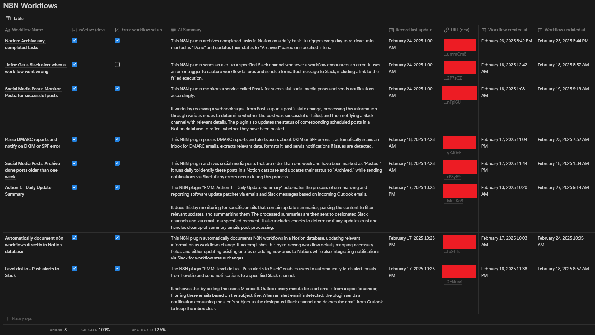
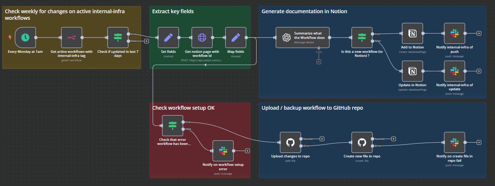

# N8N Workflows

Sharing some common work to help others out.

If you spot something, feel free to use Issues to raise suggestions, changes, recommdations or issues.

**List of Workflows**

- [365 Service Alerts Summary to Slack](#365-service-alerts-summary-to-slack)
- [Automatically document and backup N8N workflows](#automatically-document-and-backup-n8n-workflows)

## [365 Service Alerts Summary to Slack](workflows/365_Service_Alerts__Summarize_and_push_alert_to_Slack.json)

NB: _pending publish on N8N marketplace_

Intended for a dedicated Slack channel for outage notifications, and to be readable on mobile or desktop.

### Who is this for?

This is for:

- IT Administrators & small MSPs looking to streamline M365 alerts from one or multiple mailboxes into a single or specific Slack channels
- IT Admins who prefer ChatOps over management-by-email

### What does it do?

- Scans for M365 outage alert emails
- Checks if it impacts your users in specific countries (list manually defined), if the alert calls it out, and adjusts the summary accordingly.
- Uses Slack Blocks and provides a button to the M365 Incident or to admin.microsoft.com, if no link provided
- Cleans up by deleting the original alert email, after successful send to Slack
- Uses OpenAI's 4o-mini model, can be easily replaced with locally hosted Ollama or alternative service, with the same prompts.

**Credentials**

- **Outlook:** Create an Outlook credential (OAuth2.0) to point to the mailbox (regular or shared) where M365 service alerts will be received
- **Slack:** Create a Slack bot credential with access to the slack channel you want updates posted to
- **OpenAI:** Create a OpenAI credential that has access to the GPT-4O-MINI model. Recommend you use projects in OpenAI so that you may set a per-project-budget and not impact other projects.

Expect this to consume no more than 1-2 cents per month on average. Recommend configuring a separate project so you may set a per-project budget in OpenAI. Review this [OpenAI documentation](https://help.openai.com/en/articles/9186755-managing-projects-in-the-api-platform) for more info on managing Projects in the API portal.

_Don't like Slack?_ Can easily replace with [ntfy.sh](https://ntfy.sh/), Teams, Discord, or whatever platform you prefer.

**Download & Setup**

- [**Download & import the workflow**](workflows/365_Service_Alerts__Summarize_and_push_alert_to_Slack.json)
- Add your credentials (OpenAI, Slack bot connection)
- Modify the system prompt to call out the countries your users reside in

ie. _“- Assume the organization has users primarily in the U.S. and Australia. If those regions are affected, state: “Your users may have been affected.” Otherwise, add: “No impact expected for your user base.””_ **<- swap U.S. & Australia for desired countries**

**Sample Slack Output**

**Workflow diagram**

## [Automatically document and backup N8N workflows](workflows/Automatically_document_n8n_workflows_directly_in_Notion_database.json)

[Hosted version on N8N marketplace](https://n8n.io/workflows/3354-automatically-document-and-backup-n8n-workflows/)

Automatically backs up your workflows to Github and generates documentation in a Notion database.

- Weekly run, uses the "internal-infra" tag to look for new or recently modified workflows
- Uses a Notion database page to hold the workflow summary, last updated date, and a link to the workflow
- Uses OpenAI's 4o-mini to generate a summarization of what the workflow does
- Stores a backup of the workflow in GitHub (recommend a private repo)
- Sends notification to Slack channel for new or updated workflows

**Credentials**

- **Notion:** Create a database with the following columns. Column type is specified in [type].
    - Workflow Name [text]
    - isActive (dev) [checkbox]
    - Error workflow setup [checkbox]
    - AI Summary [text]
    - Record last update [date/time]
    - URL (dev) [text/url]
    - Workflow created at [date/time]
    - Workflow updated at [date/time]
- **GitHub:** Create a private repo for your workflows to be exported into
- **Slack:** Create a Slack bot credential with access to the slack channel you want updates posted to
- **OpenAI:** Create a OpenAI credential that has access to the GPT-4O-MINI model. Recommend you use projects in OpenAI so that you may set a per-project-budget and not impact other projects.

Expect this to consume no more than 1-2 cents per month on average. Recommend configuring a separate project so you may set a per-project budget in OpenAI. Review this [OpenAI documentation](https://help.openai.com/en/articles/9186755-managing-projects-in-the-api-platform) for more info on managing Projects in the API portal.

**Download & Setup**

- [**Download & import the workflow**](workflows/Automatically_document_n8n_workflows_directly_in_Notion_database.json)
- Add your credentials (N8N, Notion, Slack, GitHub)
- Insert your N8N hostname in the _Set fields_ block
- Insert your Notion database in the _Get notion page with workflow id_ block
- Change the "internal-infra" tag if desired

**Sample output in Notion**

**Workflow diagram**

