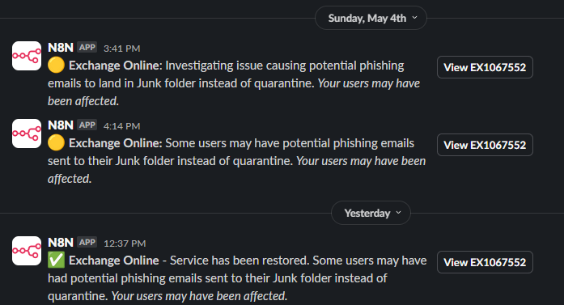

# N8N Workflows

Sharing some common work to help others out.

If you spot something, feel free to use Issues to raise suggestions, changes, recommdations or issues.

**List of Workflows**

- [365 Service Alerts Summary to Slack](#365-service-alerts-summary-to-slack)

## Workflows

### [365 Service Alerts Summary to Slack](workflows\365_Service_Alerts__Summarize_and_push_alert_to_Slack.json)

Intended for a dedicated Slack channel for outage notifications, and to be readable on mobile or desktop.

- Scans for M365 outage alert emails
- Checks if it impacts your users in specific countries (list manually defined), if the alert calls it out, and adjusts the summary accordingly.
- Uses Slack Blocks and provides a button to the M365 Incident (admin.microsoft.com)
- Cleans up by deleting the original alert email, after successful send to Slack
- Uses OpenAI's 4o-mini model, can be easily replaced with locally hosted Ollama or alternative service, with the same prompts.

**Download & Setup**

- [**Download & import the workflow**](workflows\365_Service_Alerts__Summarize_and_push_alert_to_Slack.json)
- Add your credentials (OpenAI, Slack bot connection)
- Modify the system prompt to call out the countries your users reside in

**Sample Slack Output**

**Workflow diagram**

